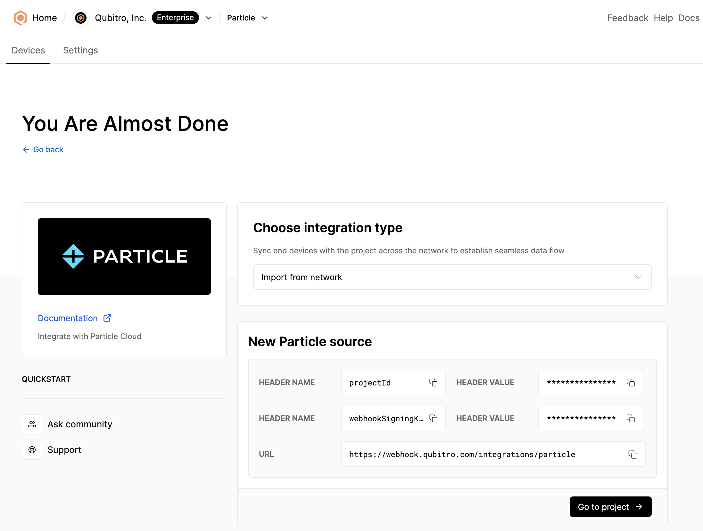
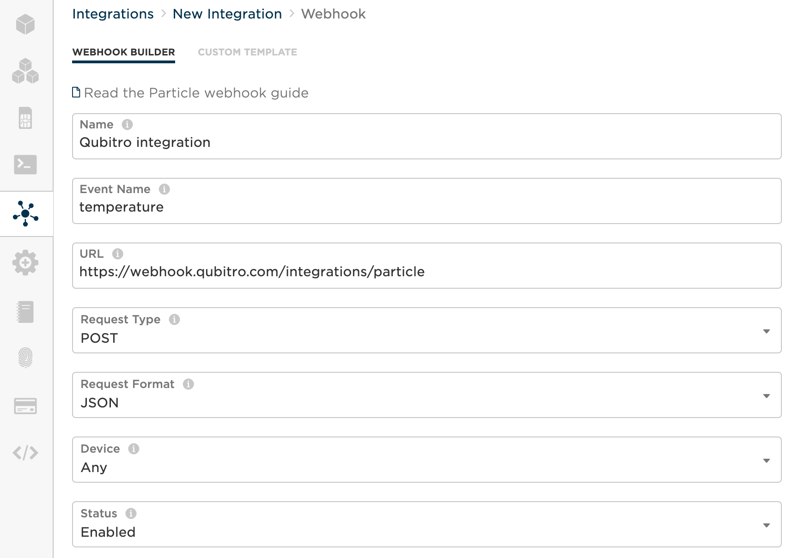
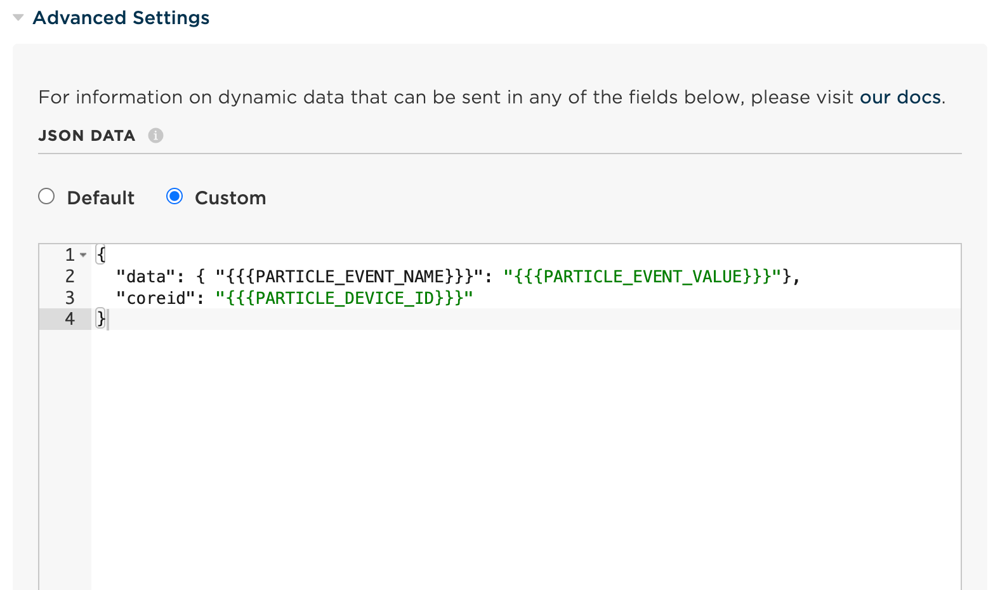
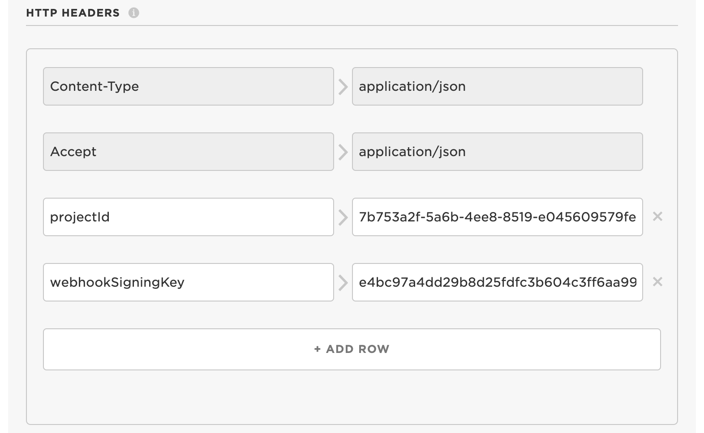
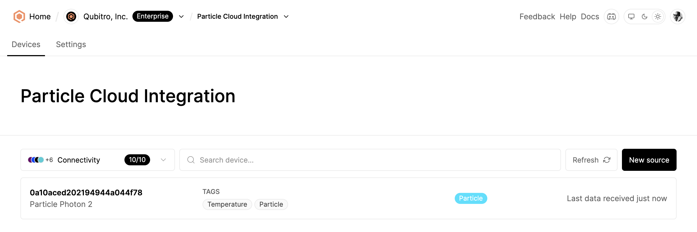
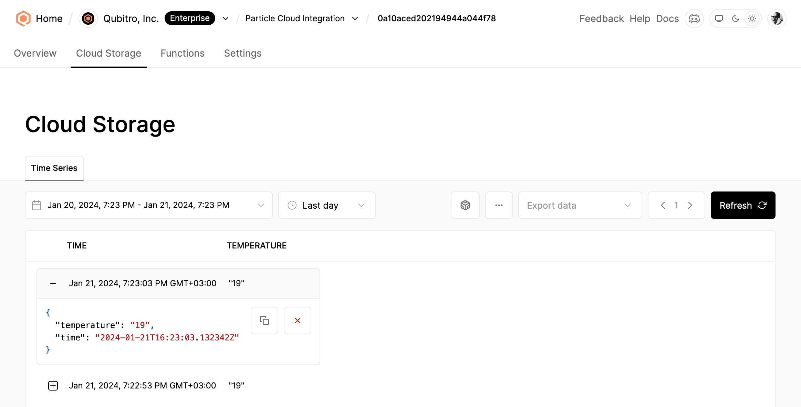
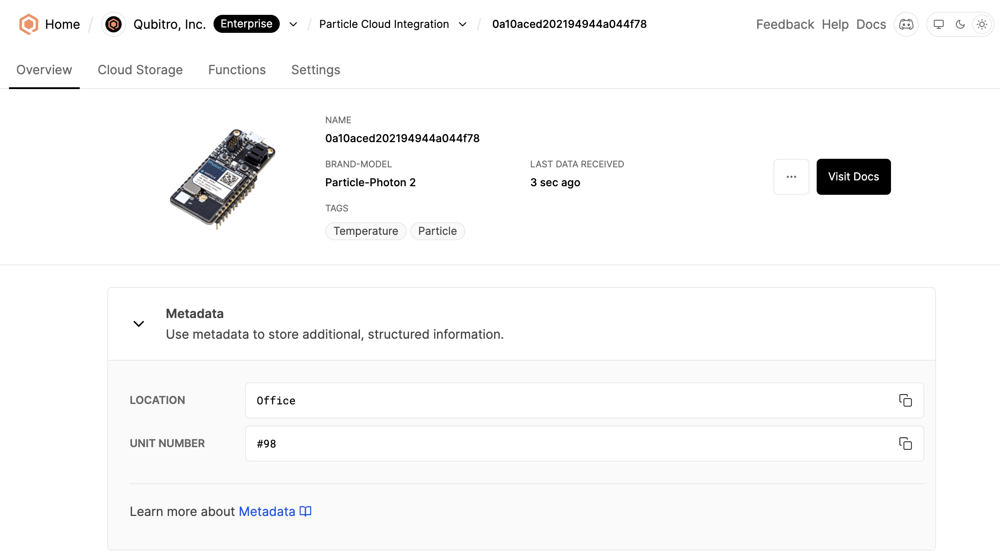

# Qubitro | Documentation - Particle Integration

Qubitro has no-code source integration support for Particle Cloud. You can learn more about Particle integrations [here](https://docs.particle.io/integrations/integrations).

## Creating the Integration

To get the required credentials, choose a project from the list, then, click on the `New source` button and click on `Particle` in the list.



Keep this page open and navigate to the [Particle Console](https://console.particle.io) to configure the integration.

### Configure Integration on Particle Console

Click on `Integrations` from the left navigation menu, then click on `+ ADD NEW INTEGRATION` button located top-right on the console and choose the `Webhook` option.

#### :one: **Step 1: URL and Request Format**

**Paste the URL** and choose **`JSON`** for the Request Format options.

<span style="color:green;">**Tip:** Set the **Device** option to **`Any`** to enable automatic syncing of all devices with Qubitro.</span>



#### :two: **Step 2: JSON Data Configuration**

**Choose `Custom`** for the JSON Data configuration and paste the following configuration.

```json
{
  "data": { "{{{PARTICLE_EVENT_NAME}}}": "{{{PARTICLE_EVENT_VALUE}}}"},
  "coreid": "{{{PARTICLE_DEVICE_ID}}}"
}
```

Example:



#### :three: **Step 3: HTTP Headers**

**Add HTTP Headers** by copying and pasting each key and their values from the page you navigated in the previous step on Qubitro Portal.

Header Name: `projectId` - Header Value: `<PROJECT_ID>`  
Header Name: `webhookSigningKey` - Header Value: `<WEBHOOK_SIGNING_KEY>`

Example:



#### :four: **Step 4: Create Webhook**

**Click on `Create Webhook`** button and go back to the Qubitro Portal.

### Verify integration

Click on the `Go to project` button and then the `Refresh` button to verify that the devices are listed successfully.



Then, navigate to the device and click on the `Cloud Storage` tab to verify the incoming data.



### (Optional) Customize device information

You can customize device information, such as avatar, name, brand, and model, by navigating to the device settings.

An example device configuration:



---

For enterprise support or further assistance, visit [Qubitro support](https://www.qubitro.com/resources/support) options.
